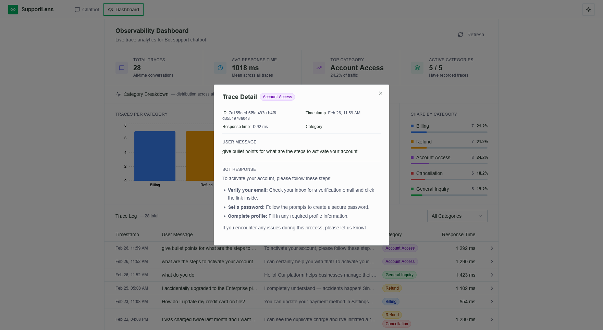
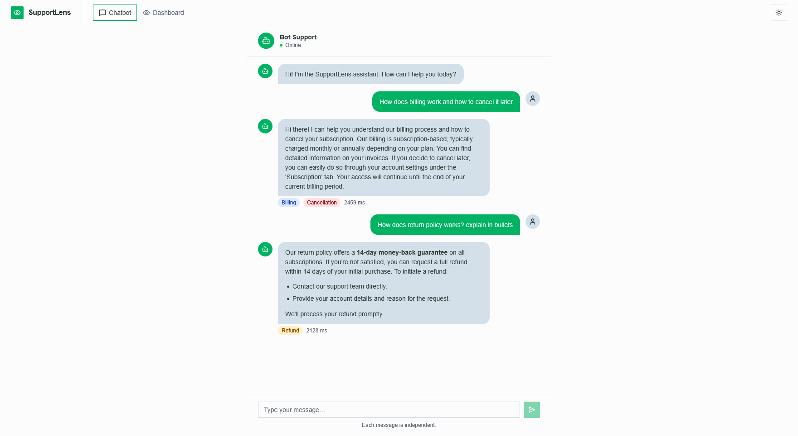

# SupportLens

A lightweight observability platform for a customer support chatbot.





## Prerequisites

- Python 3.14
- Node.js 22

## Setup

### 1. Add your Gemini API key

```bash
cd backend
cp .env.example .env
```

Edit the `.env` file and add your Gemini API key:

```
GEMINI_API_KEY=your_key_here
```

Get a free key at [aistudio.google.com](https://aistudio.google.com/app/apikey).

### 2. Backend

```bash
cd backend
python -m venv .venv
.venv\Scripts\activate       # Windows
# source .venv/bin/activate  # macOS/Linux
pip install -r requirements.txt
python seed_data.py
fastapi dev main.py
```

### 3. Frontend (new terminal)

```bash
cd frontend
cp .env.example .env
npm install
npm run dev
```

Open **http://localhost:5173**.
