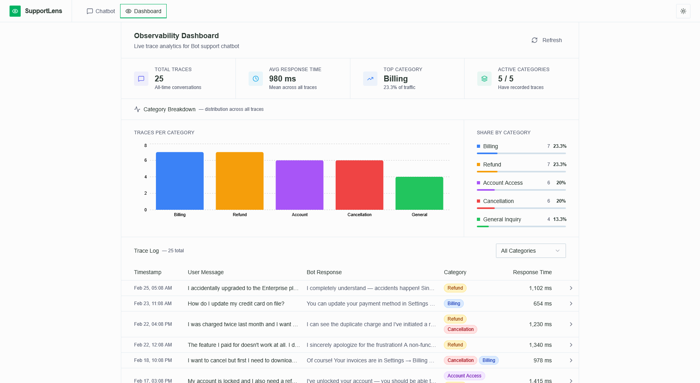
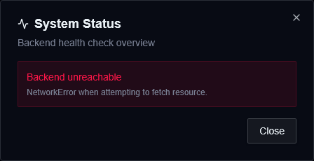
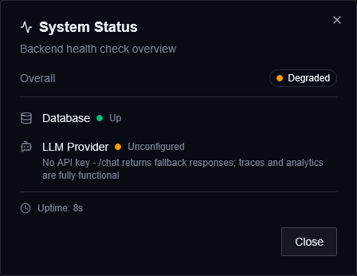
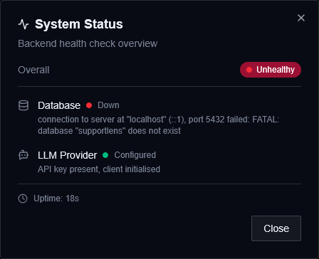

# SupportLens

A lightweight observability platform for a customer support chatbot.




## Prerequisites

- Python 3.14
- Node.js 22

## Setup

### Run with Docker

```bash
git clone https://github.com/abdxdev/supportlens.git
cd supportlens
cp .env.example .env
```

::: [!note]
Edit the `.env` file and add your Gemini API key:

```
GEMINI_API_KEY=your_key_here
```

Get a free key at [aistudio.google.com](https://aistudio.google.com/app/apikey).
:::

```bash
docker compose up --build -d
```

### Run locally without Docker

#### 1. Backend

```bash
cd backend
cp .env.example .env
```

::: [!note]
Edit the `backend/.env` file and add your Gemini API key and database credentials:

```
GEMINI_API_KEY=your_key_here
DATABASE_URL=postgresql://postgres:<password>@localhost:5432/postgres
```

Get a free key at [aistudio.google.com](https://aistudio.google.com/app/apikey).
:::

```bash
python -m venv .venv
.venv\Scripts\activate       # Windows
# source .venv/bin/activate  # macOS/Linux
python -m pip install -r requirements.txt
python seed_data.py
fastapi dev main.py
```

#### 2. Frontend (new terminal)

```bash
cd frontend
cp .env.example .env
npm install
npm run dev
```

Open **http://localhost:5173**.

## Errors

Backend unreachable


Database unreachable


LLM not configured

